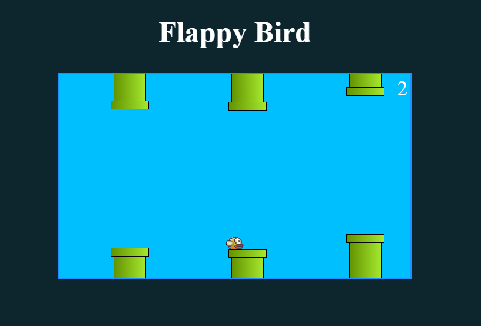

# 
Flappy Bird Game

Este projeto é um clone do famoso jogo Flappy Bird, desenvolvido como parte do aprendizado em programação web usando HTML, CSS e JavaScript. O jogo simula a experiência do Flappy Bird original, onde o jogador controla um pássaro e deve navegar entre tubos verdes, acumulando pontos à medida que evita colisões.

  

## Funcionalidades Principais

- **Controle do Pássaro:** Use a tecla de seta para cima para controlar o movimento do pássaro, simulando o voo.
- **Pontuação:** O jogador acumula pontos à medida que passa pelos tubos sem colidir.
- **Colisão:** O jogo termina se o pássaro colidir com os tubos.

## Como Jogar

1. Clone o repositório para o seu ambiente local.
2. Abra o arquivo `index.html` em um navegador da web.
3. Pressione a tecla de seta para cima para fazer o pássaro voar.
4. Desvie dos tubos verdes para ganhar pontos.
5. O jogo termina se o pássaro colidir com os tubos.

## Tecnologias Utilizadas

- HTML
- CSS
- JavaScript

## Estrutura do Projeto

- **index.html:** Contém a estrutura HTML do jogo.
- **flappy.css:** Arquivo de estilo CSS para estilizar o jogo.
- **flappy.js:** Lógica do jogo em JavaScript.

## Contato

- LinkedIn: [Gabriel de Lima Furini](Seu-LinkedIn-Profile-URL)
- Email: [seuemail@example.com](mailto:seuemail@example.com)

---

**Apreciaremos se você deixar uma ⭐️ no repositório se achou útil!**
